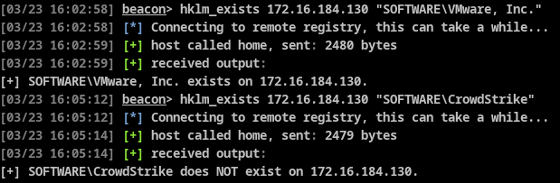
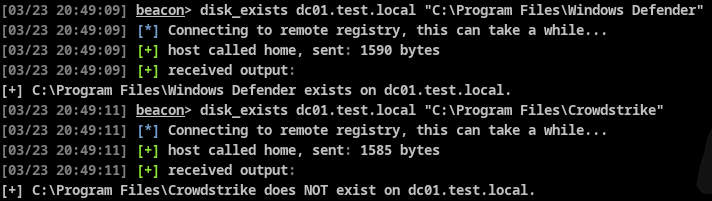
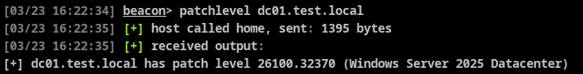

# BOF Collection

Collection of Beacon Object Files (BOFs) that I wrote.

## `hklm_exists`

Credit to [Outflank](https://www.youtube.com/watch?v=MxDq552Di3Y) for the research.

This BOF uses the Remote Registry Protocol (RRP) to enumerate registry keys in HKLM of the target machine. It uses an information leak that discloses the presence of a key when an attempt is made to delete that key.

### IMPORTANT

* The BOF will do a sanity check if the key is not accessible by the current user. If it is, the BOF will exit early to prevent regkey deletion.
* Requires user to be domain-joined.
* Remote Registry Service must be running on the target. If the Startup type is not set to "Disabled", it will start automatically in my experience. [The `\\.\pipe\winreg` trick is not needed](https://x.com/splinter_code/status/1715876413474025704) in this case.

## `disk_exists`

Credit to [Outflank](https://www.youtube.com/watch?v=MxDq552Di3Y) for the research.

 

This BOF uses the Remote Registry Protocol (RRP) to enumerate files/folders of the target machine. It uses an information leak that discloses the presence of a file/folder when an attempt is made save a regkey file to the specified path.

### IMPORTANT

* The return values presented in the Outflank talk do not match my personal experience. File absence returns `ERROR_ACCESS_DENIED`, file presence returns `ERROR_ALREADY_EXISTS`. Moreover, even though the return value may indicate `ERROR_ACCESS_DENIED`, I have seen that it can still write the file to disk, depending on the current user's privileges. So this BOF may leave artifacts!
* Requires user to be domain-joined.
* Remote Registry Service must be running on the target. If the Startup type is not set to "Disabled", it will start automatically in my experience. [The `\\.\pipe\winreg` trick is not needed](https://x.com/splinter_code/status/1715876413474025704) in this case.

## `patchlevel`

Credit to [Outflank](https://www.youtube.com/watch?v=MxDq552Di3Y) for the research.

 

This BOF uses the Remote Registry Protocol (RRP) to read `HKLM\SOFTWARE\Microsoft\Windows NT\CurrentVersion`, which contains the exact patch level of a machine.

### IMPORTANT

* Remote Registry Service must be running on the target. If the Startup type is not set to "Disabled", it will start automatically in my experience. [The `\\.\pipe\winreg` trick is not needed](https://x.com/splinter_code/status/1715876413474025704) in this case.
* Requires user to be domain-joined.

# Compilation instructions

Other than your usual MinGW compiler, this repo requires [boflink](https://github.com/MEhrn00/boflink) in `$PATH`. Other than that, just run `make`!

---

**DISCLAIMER:** The creators and contributors of this repository accept no liability for any loss, damage, or consequences resulting from the use of the information or code contained in this repo. By utilizing this repo, you acknowledge and accept full responsibility for your actions. Use at your own risk.
